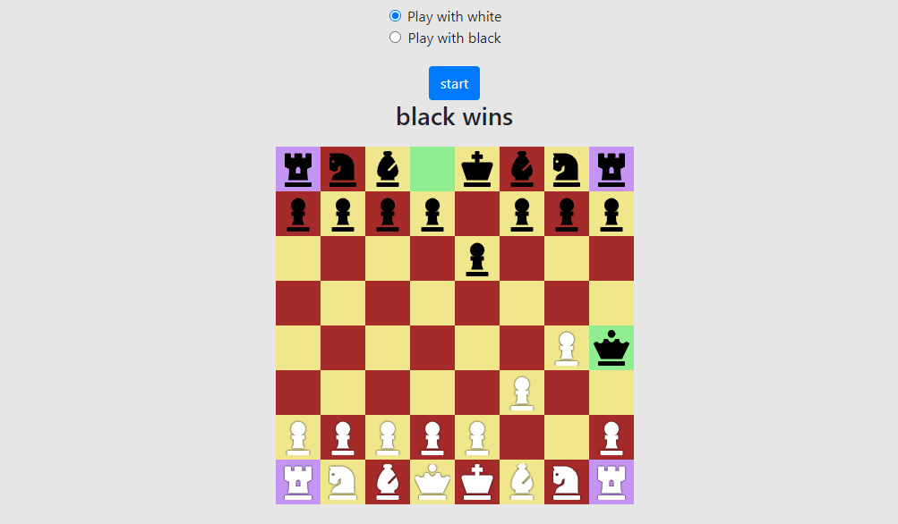

# CHESSGAME

# What it does

- A chess board that you can use to play human vs human
- It shows most recent move
- It shows if castling are available
- It finish game for lack of enough material to checkmate
- It finish game when stalemate of checkmate

## Built With

- HTML5.
- CSS3.
- Bootstrap.
- React.js.
- JavaScript.
- AWS S3.

## Live Version

[Live](http://chessgame-andres-porras.s3-website-us-east-1.amazonaws.com/)

## Authors

**Oscar Russi**
- Github: [@andresporras3423](https://github.com/andresporras3423/)
- Linkedin: [Oscar Russi](https://www.linkedin.com/in/oscar-andres-russi-porras/)
- Twitter: [@OscarRussi1](https://twitter.com/OscarRussi1)

## 🤝 Contributing

This is a project for educational purposes only. We are not accepting contributions.

## Attributions and Credit

Special thanks to Microverse, for this learning opportunity. 

## Show your support

Give a ⭐️ if you like this project!

## Enjoy!
